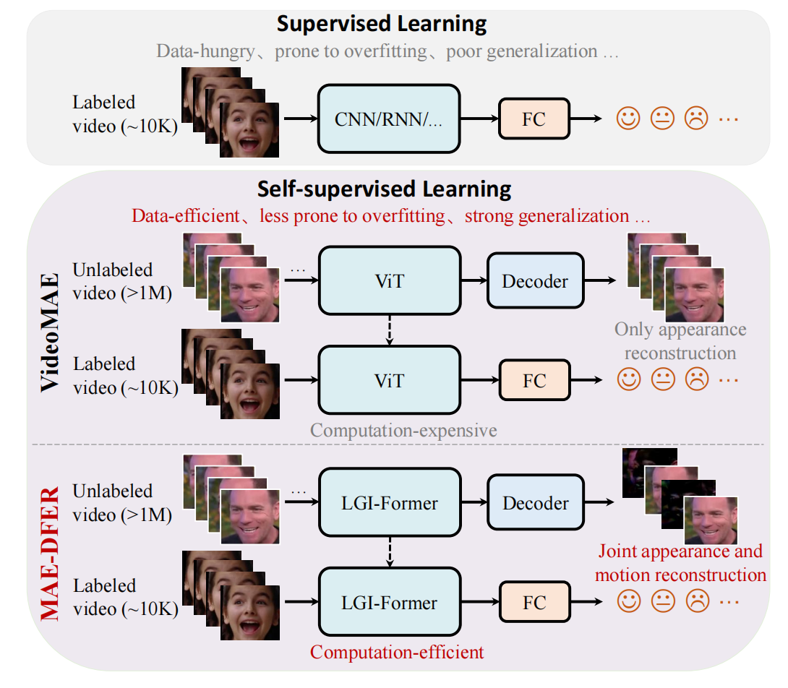
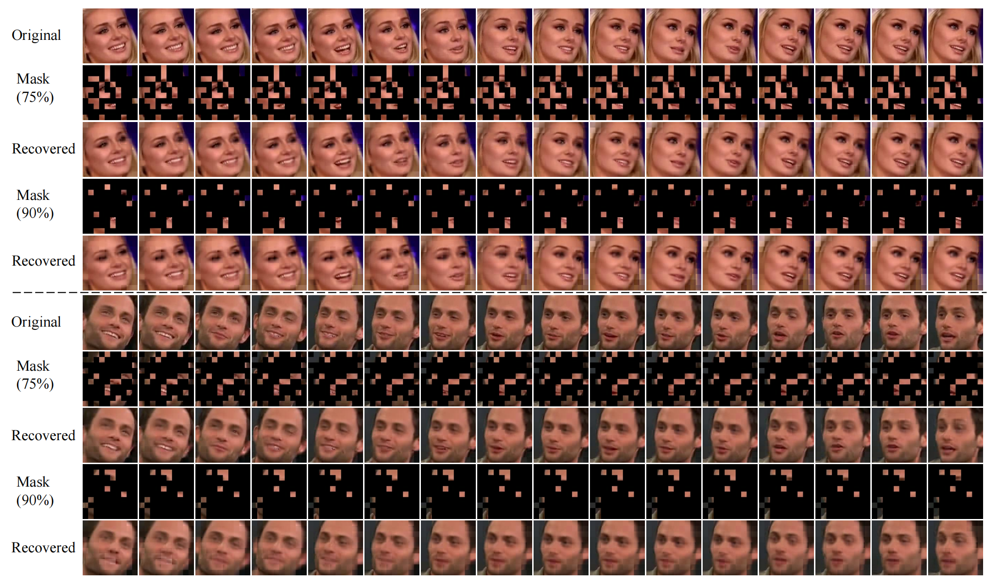

# MAE-DFER: Efficient Masked Autoencoder for Self-supervised Dynamic Facial Expression Recognition (ACM MM 2023)

[](https://paperswithcode.com/sota/dynamic-facial-expression-recognition-on-dfew?p=mae-dfer-efficient-masked-autoencoder-for)<br>
[](https://paperswithcode.com/sota/dynamic-facial-expression-recognition-on?p=mae-dfer-efficient-masked-autoencoder-for)<br>
[](https://paperswithcode.com/sota/dynamic-facial-expression-recognition-on-mafw?p=mae-dfer-efficient-masked-autoencoder-for)<br>

> [[arXiv]](https://arxiv.org/abs/2307.02227), [[ACM Digital Library]](https://dl.acm.org/doi/10.1145/3581783.3612365) <br>
> [Licai Sun](https://scholar.google.com/citations?user=7qo_cTcAAAAJ&hl=en&oi=ao), [Zheng Lian](https://scholar.google.com/citations?user=S34nWz0AAAAJ&hl=en), [Bin Liu](https://scholar.google.com/citations?user=UEB_5QEAAAAJ&hl=en), and [Jianhua Tao](https://scholar.google.com/citations?user=781jbHMAAAAJ&hl=en)<br>
> University of Chinese Academy of Sciences & Institute of Automation, Chinese Academy of Sciences & Tsinghua University<br>

## 📰 News
**[2024.01.02]** We provide the fine-tuned models across five folds on MAFW. Please check them below.<br>
**[2023.12.31]** We upload the pre-training code.<br>
**[2023.12.13]** We provide the fine-tuned model on FERV39k. Please check it below.<br>
**[2023.12.11]** We provide the fine-tuned models across five folds on DFEW. Please check them below.<br>
**[2023.10.31]** We upload the [poster](figs/MAE-DFER%20Poster.pdf) of MAE-DFER for ACM MM 2023.<br>

## ✨ Overview

Dynamic Facial Expression Recognition (DFER) is facing **supervised dillema**. On the one hand, current efforts in DFER focus on developing *various* deep supervised models, but only achieving *incremental* progress which is mainly attributed to the *longstanding lack* of large-scale high-quality datasets. On the other hand, due to the *ambiguity* and *subjectivity* in facial expression perception, acquiring large-scale high-quality DFER samples is pretty *time-consuming* and *labor-intensive*. Considering that there are massive unlabeled facial videos on the Internet, this work aims to **explore a new way** (i.e., self-supervised learning) which can fully exploit large-scale *unlabeled* data to largely advance the development of DFER.

<p align="center">
   <br>
  Overview of our MAE-DFER.
</p>

Inspired by recent success of VideoMAE, MAE-DFER makes an early attempt to devise a novel masked autoencoder based self-supervised framework for DFER. It improves VideoMAE by developing an *efficient* LGI-Former as the encoder and introducing *joint* masked appearance and motion modeling. With these two core designs, MAE-DFER *largely* reduces the computational cost (about 38% FLOPs) during fine-tuning while having comparable or even *better* performance.

<p align="center">
   <br>
  The architecture of LGI-Former.
</p>
<!--  -->

Extensive experiments on *six* DFER datasets show that our MAE-DFER *consistently* outperforms the previous best supervised methods by *significant* margins (**\+5∼8%** UAR on three *in-the-wild* datasets and **\+7∼12%** WAR on three *lab-controlled* datasets), which demonstrates that it can learn *powerful* dynamic facial representations for DFER via large-scale self-supervised pre-training. We believe MAE-DFER **has paved a new way** for the advancement of DFER and can inspire more relevant research in this field and even other related tasks (e.g., dynamic micro-expression recognition and facial action unit detection).

## 🚀 Main Results

### ✨ DFEW


### ✨ FERV39k


### ✨ MAFW


## 👀 Visualization

### ✨ Reconstruction 


More samples without showing frame difference:



### ✨ t-SNE on DFEW


## 🔨 Installation

Main prerequisites:

* `Python 3.8`
* `PyTorch 1.7.1 (cuda 10.2)`
* `timm==0.4.12`
* `einops==0.6.1`
* `decord==0.6.0`
* `scikit-learn=1.1.3`
* `scipy=1.10.1`
* `pandas==1.5.3`
* `numpy=1.23.4`
* `opencv-python=4.7.0.72`
* `tensorboardX=2.6.1`

If some are missing, please refer to [environment.yml](environment.yml) for more details.


## ➡️ Data Preparation

Please follow the files (e.g., [dfew.py](preprocess/dfew.py)) in [preprocess](preprocess) for data preparation.

Specifically, you need to enerate annotations for dataloader ("<path_to_video> <video_class>" in annotations). 
The annotation usually includes `train.csv`, `val.csv` and `test.csv`. The format of `*.csv` file is like:

```
dataset_root/video_1  label_1
dataset_root/video_2  label_2
dataset_root/video_3  label_3
...
dataset_root/video_N  label_N
```

An example of [train.csv](saved/data/dfew/org/split01/train.csv) of DFEW fold1 (fd1) is shown as follows:

```
/mnt/data1/brain/AC/Dataset/DFEW/Clip/jpg_256/02522 5
/mnt/data1/brain/AC/Dataset/DFEW/Clip/jpg_256/02536 5
/mnt/data1/brain/AC/Dataset/DFEW/Clip/jpg_256/02578 6
```

Note that, `label` for the pre-training dataset (i.e., VoxCeleb2) is dummy label, you can simply use `0` (see [voxceleb2.py](preprocess/voxceleb2.py)).

## 🔄 Pre-training MAE-DFER

- VoxCeleb2

    ```
    sh scripts/voxceleb2/pretrain_local_global_attn_depth16_region_size2510_with_diff_target_102.sh
    ```
    
    You can download our pre-trained model on VoxCeleb2 from [here](https://drive.google.com/file/d/1nzvMITUHic9fKwjQ7XLcnaXYViWTawRv/view?usp=sharing) and put it into [this folder](saved/model/pretraining/voxceleb2/videomae_pretrain_base_dim512_local_global_attn_depth16_region_size2510_patch16_160_frame_16x4_tube_mask_ratio_0.9_e100_with_diff_target_server170).

## ⤴️ Fine-tuning with pre-trained models

- DFEW

    ```
    sh scripts/dfew/finetune_local_global_attn_depth16_region_size2510_with_diff_target_164.sh
    ```
  
    <!--Our running log file can be found in [this file](logs/dfew.out). -->

    The fine-tuned checkpoints and logs across five folds on DFEW are provided as follows: 
    |  Fold    | UAR        | WR       |      Fine-tuned   Model            |
    | :------: | :--------: | :------: | :-----------------------:          |
    |  1       | 62.59      | 74.88    | [log](https://drive.google.com/file/d/1dYhJiEm56V1ZwJyj-rvC8TjdmrUMa0hO/view?usp=sharing) / [checkpoint](https://drive.google.com/file/d/1wRxwEZlrc3z3DqQ84xm_olmqRsj2obH3/view?usp=sharing) | 
    |  2       | 61.96      | 72.49    | [log](https://drive.google.com/file/d/1pwXeaevtW0Xynr248HKvMx9eWxoxdY_n/view?usp=sharing) / [checkpoint](https://drive.google.com/file/d/1lY4L2PMVWuF93K6_VqEl7QrPoSK0SvaQ/view?usp=sharing) | 
    |  3       | 64.00      | 74.91    | [log](https://drive.google.com/file/d/1c-3sC4menIzphya-y3iZ-lT-54Ls-9Yv/view?usp=sharing) / [checkpoint](https://drive.google.com/file/d/1FPKxBoGO3VXvLhcHY8iOPb9lQPi0_C1z/view?usp=sharing) | 
    |  4       | 63.07      | 74.05    | [log](https://drive.google.com/file/d/1ZdadMpksJtUUTx6N2Fa6LI91qs7GV_S2/view?usp=sharing) / [checkpoint](https://drive.google.com/file/d/1yFDc1n8SaTEQWrVX8k65loQm45rfwQeO/view?usp=sharing) | 
    |  5       | 65.42      | 75.81    | [log](https://drive.google.com/file/d/18KnsGWZlgN3CZvfjs1UjH4E2AqVltsda/view?usp=sharing) / [checkpoint](https://drive.google.com/file/d/1wmXO4M2kjpAOnvof8CmpJE6wUrxMUOgw/view?usp=sharing) |
    |  Total   | 63.41      | 74.43    | - |

- FERV39k

    ```
    sh scripts/ferv39k/finetune_local_global_attn_depth16_region_size2510_with_diff_target_164.sh
    ```
  
    <!--Our running log file can be found in [this file](logs/ferv39k.out). -->
    
    The fine-tuned checkpoints and logs on FERV39k are provided as follows:
    |  Version    | UAR        | WR       |      Fine-tuned   Model            |
    | :------:    | :--------: | :------: | :-----------------------:          |
    |  Reproduced | 43.29      | 52.50    | [log](https://drive.google.com/file/d/1wnr7c9P43UtQ9wCzOiqGCYmaxkoXf2AE/view?usp=sharing) / [checkpoint](https://drive.google.com/file/d/1vq9WxuV229spEX7JQCMTluLXvvefLRzq/view?usp=sharing) |
    |  Reported   | 43.12      | 52.07    | [log](logs/ferv39k.out) / -        | 
  
    Note that we lost the original ckpt for this dataset. However, the reproduced result is slightly better than that reported in the paper.
- MAFW

    ```
    sh scripts/mafw/finetune_local_global_attn_depth16_region_size2510_with_diff_target_164.sh
    ```
    
    <!--Our running log file can be found in [this file](logs/mafw.out). -->

    The fine-tuned checkpoints and logs across five folds on MAFW are provided as follows: 
    |  Fold    | UAR        | WR       |      Fine-tuned   Model            |
    | :------: | :--------: | :------: | :-----------------------:          |
    |  1       | 36.11      | 46.71    | [log](https://drive.google.com/file/d/1fhdiIbAVpp4qea_ri6l6etp-AaSM9DyH/view?usp=sharing) / [checkpoint](https://drive.google.com/file/d/1BXTp-2mdy0fvrcjwFsZ4fPY53E4DotvR/view?usp=sharing) | 
    |  2       | 42.37      | 54.82    | [log](https://drive.google.com/file/d/1L7HK7MR-WLIA1I2mU77LuGhA8OZA2Agv/view?usp=sharing) / [checkpoint](https://drive.google.com/file/d/1Lzm50nPzZtTODfNYSkSLm09mhExHu2eL/view?usp=sharing) | 
    |  3       | 46.25      | 58.87    | [log](https://drive.google.com/file/d/1R3UsOK0qlmFKaNRdlX55GjrYRwKlISO1/view?usp=sharing) / [checkpoint](https://drive.google.com/file/d/1WlCTw5OjV6SZ7L7rU5xzvbVD_GTcp8CC/view?usp=sharing) | 
    |  4       | 45.42      | 59.50    | [log](https://drive.google.com/file/d/1LlBs2fQyv6nZBQnrVIvCXmyHqKPm2ARm/view?usp=sharing) / [checkpoint](https://drive.google.com/file/d/18fdMGu-GdYxUmCEG-33NR3hxvHFyrO-v/view?usp=sharing) | 
    |  5       | 41.66      | 55.27    | [log](https://drive.google.com/file/d/1rQb1WX9e4xuqgofFhLbcl-kRJO3Hgh4l/view?usp=sharing) / [checkpoint](https://drive.google.com/file/d/1CO6OY-P6oM5LMikLTlB5iz_AXack2vfH/view?usp=sharing) |
    |  Total (Reproduced)   | 42.36      | 55.03    | - |
    |  Total (Reported)     | 41.62      | 54.31    | - |

    Note that we lost the original ckpts for this dataset. However, the reproduced result is slightly better than that reported in the paper.

## ☎️ Contact 

If you have any questions, please feel free to reach me out at `licai.sun@oulu.fi`.

## 👍 Acknowledgements

This project is built upon [VideoMAE](https://github.com/MCG-NJU/VideoMAE). Thanks for their great codebase.

## ✏️ Citation

If you think this project is helpful, please feel free to leave a star⭐️ and cite our paper:

```
@inproceedings{sun2023mae,
    author = {Sun, Licai and Lian, Zheng and Liu, Bin and Tao, Jianhua},
    title = {MAE-DFER: Efficient Masked Autoencoder for Self-Supervised Dynamic Facial Expression Recognition},
    year = {2023},
    booktitle = {Proceedings of the 31st ACM International Conference on Multimedia},
    pages = {6110–6121}
}

@article{sun2023mae,
  title={MAE-DFER: Efficient Masked Autoencoder for Self-supervised Dynamic Facial Expression Recognition},
  author={Sun, Licai and Lian, Zheng and Liu, Bin and Tao, Jianhua},
  journal={arXiv preprint arXiv:2307.02227},
  year={2023}
}
```


