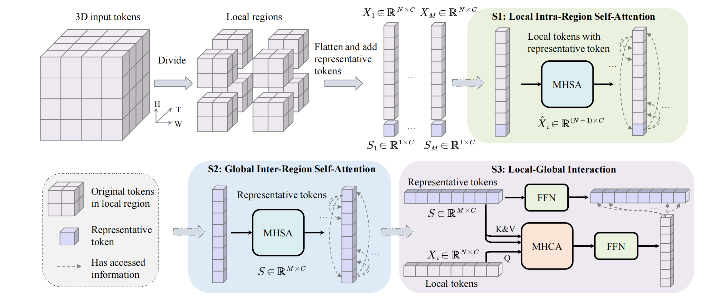
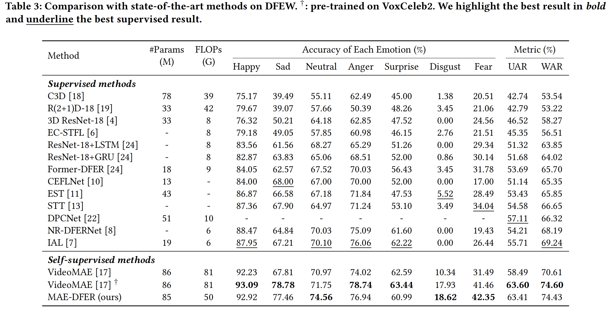
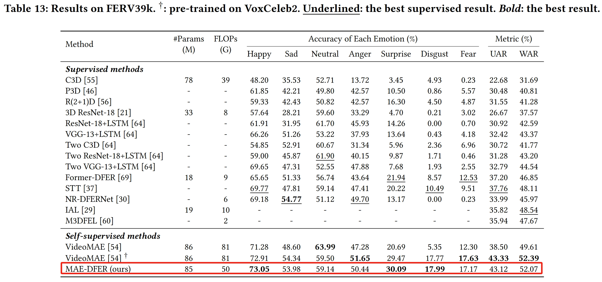
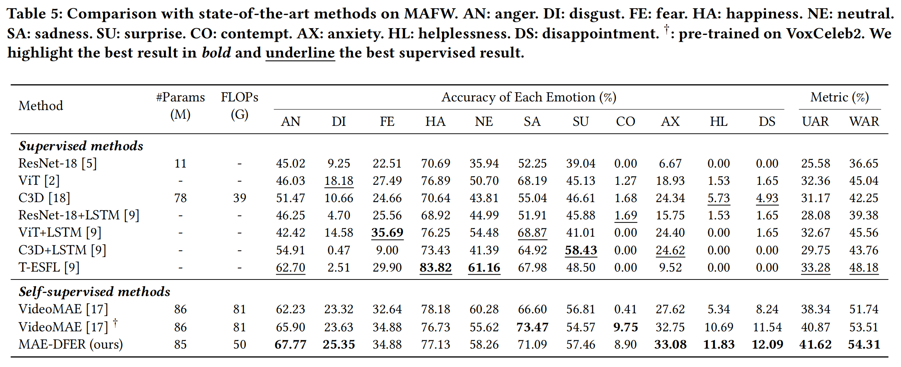
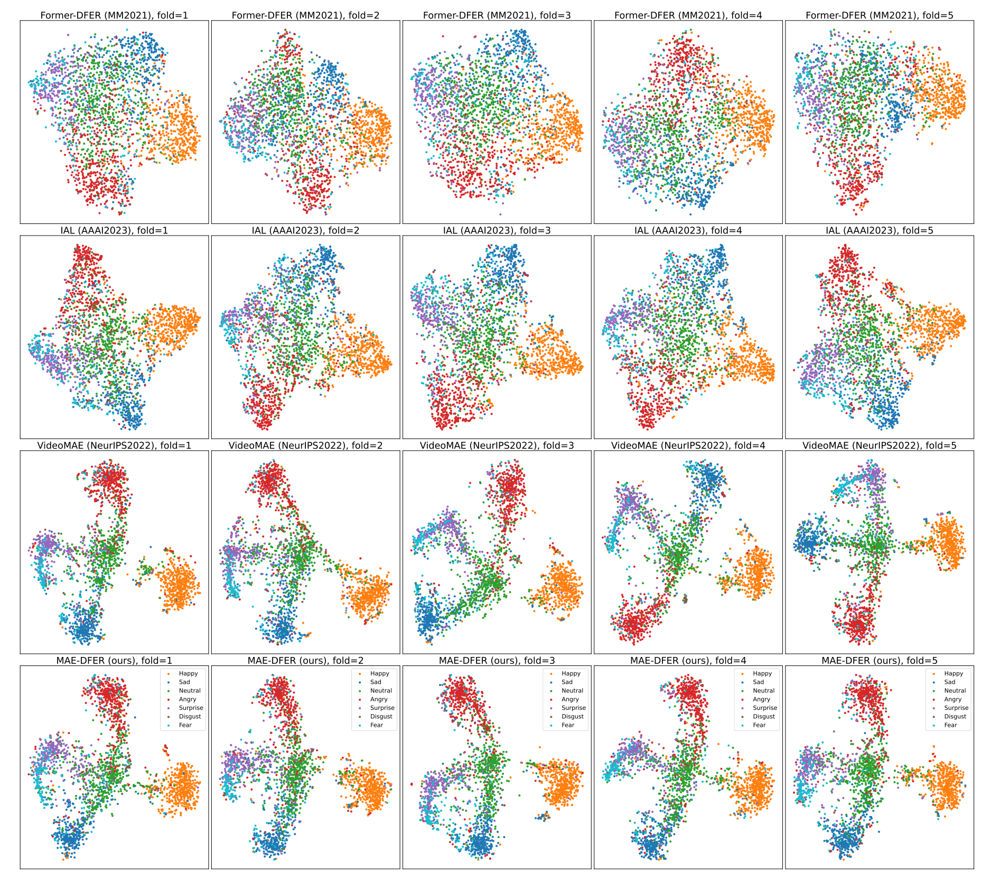

# MAE-DFER: Efficient Masked Autoencoder for Self-supervised Dynamic Facial Expression Recognition

## ✨ Abstract

Dynamic facial expression recognition (DFER) is essential to the development of intelligent and empathetic machines. Prior efforts in this field mainly fall into supervised learning paradigm, which is restricted by the limited labeled data in existing datasets. Inspired by recent unprecedented success of masked autoencoders (e.g., VideoMAE), this paper proposes MAE-DFER, a novel self-supervised method which leverages large-scale self-supervised pre-training on abundant unlabeled data to advance the development of DFER. Since the vanilla Vision Transformer (ViT) employed in VideoMAE requires substantial computation during fine-tuning, MAE-DFER develops an efficient local-global interaction Transformer (LGI-Former) as the  encoder. LGI-Former first constrains self-attention in local spatiotemporal regions and then utilizes a small set of learnable representative tokens to achieve efficient local-global information exchange, thus avoiding the expensive computation of global space-time self-attention in ViT. Moreover, in addition to the standalone appearance content reconstruction in VideoMAE, MAE-DFER also introduces explicit facial motion modeling to encourage LGI-Former to excavate both static appearance and dynamic motion information. Extensive experiments on six datasets show that MAE-DFER consistently outperforms state-of-the-art supervised methods by significant margins, verifying that it can learn powerful dynamic facial representations via large-scale self-supervised pre-training. Besides, it has comparable or even better performance than VideoMAE, while largely reducing the computational cost (about 38\% FLOPs). We believe MAE-DFER has paved a new way for the advancement of DFER and can inspire more relavant research in this field and even other related tasks.

The architecture of LGI-Former is shown as follows:




## 🚀 Main Results

### ✨ DFEW



### ✨ FERV39k



### ✨ MAFW




## 👀 Visualization

### ✨ Reconstruction 

Sample with showing frame difference (According to the reviewer's request, we show both the reconstructed frame difference signal in *even* frames and the whole video in *all* frames by adding the reconstructed frame difference signal in *even* frames with the adjacent reconstructed *odd* frames):


More samples without showing frame difference (For simplicity, we do not show the reconstructed frame difference signal and only show the whole reconstructed video in the Appendix of the paper):


### ✨ t-SNE on DFEW





## 🔨 Installation

Main prerequisites:

* `Python 3.8`
* `PyTorch 1.7.1 (cuda 10.2)`
* `timm==0.4.12`
* `einops==0.6.1`
* `decord==0.6.0`
* `scikit-learn=1.1.3`
* `scipy=1.10.1`
* `pandas==1.5.3`
* `numpy=1.23.4`
* `opencv-python=4.7.0.72`
* `tensorboardX=2.6.1`

If some are missing, please refer to [environment.yml](environment.yml) for more details.


## ➡️ Data Preparation

Please follow the files (e.g., [dfew.py](preprocess/dfew.py)) in [preprocess](preprocess) for data preparation.

Specifically, you need to enerate annotations for dataloader ("<path_to_video> <video_class>" in annotations). 
The annotation usually includes `train.csv`, `val.csv` and `test.csv`. The format of `*.csv` file is like:

```
dataset_root/video_1  label_1
dataset_root/video_2  label_2
dataset_root/video_3  label_3
...
dataset_root/video_N  label_N
```

An example of [train.csv](saved/data/dfew/org/split01/train.csv) of DFEW fold1 (fd1) is shown as follows:

```
/mnt/data1/brain/AC/Dataset/DFEW/Clip/jpg_256/02522 5
/mnt/data1/brain/AC/Dataset/DFEW/Clip/jpg_256/02536 5
/mnt/data1/brain/AC/Dataset/DFEW/Clip/jpg_256/02578 6
```

## 📍Pre-trained Model

Download the model pre-trained on VoxCeleb2 from [this link](https://drive.google.com/file/d/1nzvMITUHic9fKwjQ7XLcnaXYViWTawRv/view?usp=sharing) and put it into [this folder](saved/model/pretraining/voxceleb2/videomae_pretrain_base_dim512_local_global_attn_depth16_region_size2510_patch16_160_frame_16x4_tube_mask_ratio_0.9_e100_with_diff_target_server170).

## ⤴️ Fine-tuning with pre-trained models

- DFEW

    ```
    sh scripts/dfew/finetune_local_global_attn_depth16_region_size2510_with_diff_target_164.sh
    ```
  
    Our running log file can be found in [this file](logs/dfew.out).

- FERV39k

    ```
    sh scripts/ferv39k/finetune_local_global_attn_depth16_region_size2510_with_diff_target_164.sh
    ```
  
    Our running log file can be found in [this file](logs/ferv39k.out).

- MAFW

    ```
    sh scripts/mafw/finetune_local_global_attn_depth16_region_size2510_with_diff_target_164.sh
    ```
  
    Our running log file can be found in [this file](logs/mafw.out).


## 📰 TODO

1. Release the fine-tuned models on all DFER datasets.


